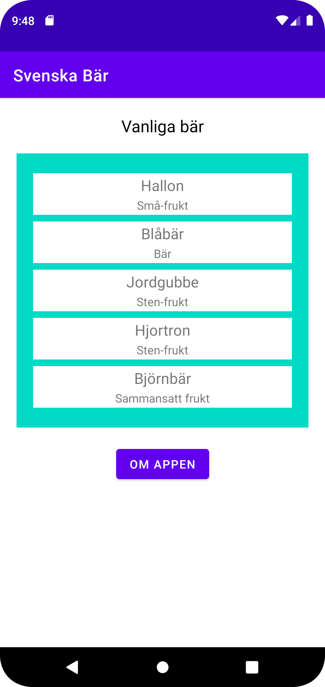
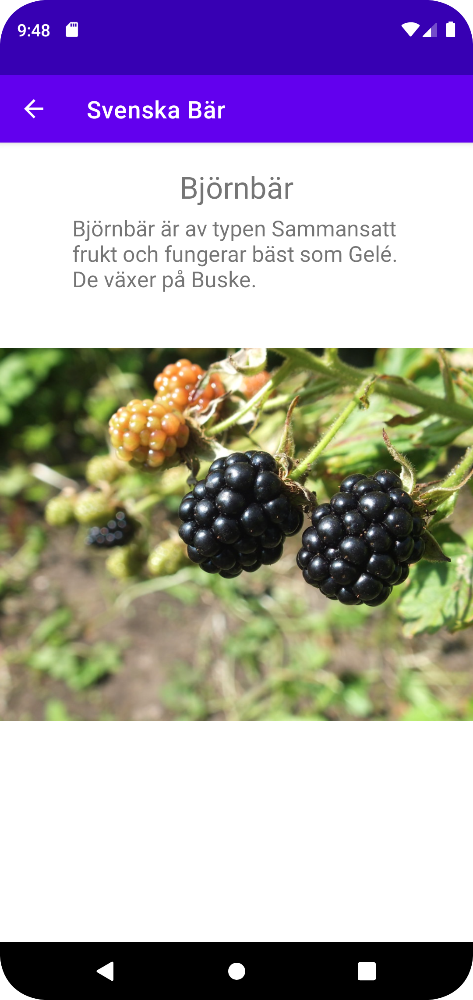
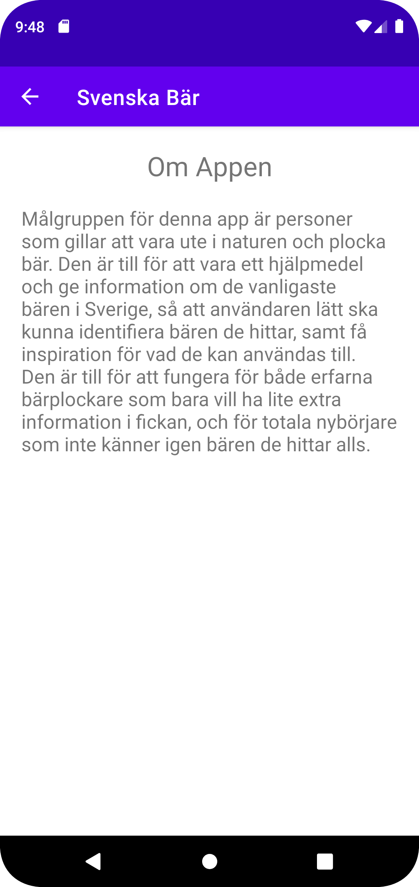

*Projektrapport*

Detta projekt var till stor del väldigt likt uppgift 5 (networking), då man skulle ha en recyclerview som visade upp json data tagen från internet. 
Den största skillnaden var att vi skulle skriva datan själva. 
Till att börja med lades datan in i json-filen. Tanken var att appen skulle handla om bär, och fungera som ett hjälpmedel ang att plocka bär.
Hur de växer, vad de passar att användas till, vilken typ av växt det är, etc. 
efter det skapades recyclerviewen. Även fast vi gjort det flera gånger nu så var det väldigt komplext. Dock blev det mycket lättare eftersom vi hade vår gamla kod att kolla på.
Det svåra i uppgiften kom med VG-kraven. 
Då det ändå var ganska lätt att lägga till recyclerviewen så var det mycket svårare att faktiskt gå in efteråt och ändra saker.
Jag försökte använda mig av de inbyggda funktionerna i recyclerviewen för att skicka all json-data, men jag lyckades inte få det att fungera. 
Istället löstes detta genom att skapa flera osynliga TextViews (med text-color transparent) som kunde hålla datan som skickades med json utan att faktiskt visa upp den på hemskärmen. 

```
public void displayDetails (View view) {
    Intent intent = new Intent(MainActivity.this, DetailActivity.class);

    ViewGroup v = (ViewGroup) view.getParent();

    TextView nameView = v.findViewById(R.id.item_name_text);
    ...
    intent.putExtra("name", nameView.getText().toString());
    ...
    startActivity(intent);
    ...
}
```
Figur 1 Koden som skickar datan från main activity till detail activty (endast namn som exempel).

Vilken information som skickades bestämdes beroende på vilket recyclerview item som klickades på. 
Detta gjordes genom att lägga till en knapp på varje recycler item och sen ha en onclick funktion i xml som länkade till en funktion i main activity. 

Mottagandet av datan skulle fungera på samma sätt oavsett vilken metod som användes för att skicka datan, så den svåra biten med det var att få fram bilden.
Då bilden fanns redo i projektet redan, så behövde bara strängen i datan matcha bildens id i drawable-mappen. 
Efter att ha googlat runt lite så hittade jag en lösning på det som gjorde om strängen till ett id som sen kunde jämföras och läggas in i imageviewen. 

```
@Override
protected void onCreate(Bundle savedInstanceState) {
    ...
    ImageView img = findViewById(R.id.display_img);
    ...
    img.setImageResource(getImageId(this, extras.getString("img")));
}

public static int getImageId(Context context, String imageName) {
    return context.getResources().getIdentifier("drawable/" + imageName, null, context.getPackageName());
}
```
Figur 2 Koden som hämtar datan från MainActivity och lägger in bilden i DetailActivitys ImageView. 


Figur 3 Skärmdump av hemskärmen med recyclerview.


Figur 4 Skärmdump av detaljsidan, som finns för varje bär i listan.


Figur 5 Skärmdump av om-sidan. 